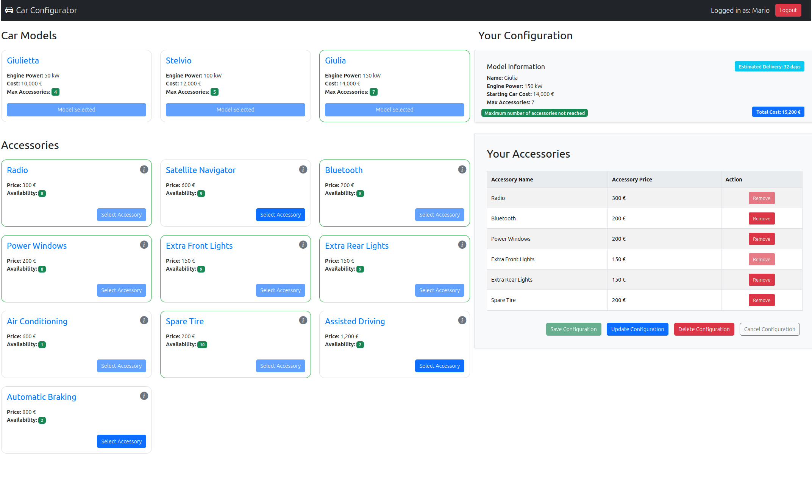

# Exam #2: "Car Configurator"
## Student: s323713 Trad Gianfranco 

## React Client Application Routes

- Route `/`: If the user is not logged in it serves as the website's homepage that shows the list of models with their information and the list of accessories with their basic information (names, availability, price). If the user is logged on it serves at the configuration page where the previous list of models and accessories (the accessories list is enriched with the information regarding the constraints) becomes dynamic in order to enable the user to retrieve, create, update and delete its configuration.
- Route `/login`: Route that handles the login operation with a Login form. After a succesful login, the user is redirected to `/` in order to retrieve, create, update and delete its configuration.
- Route `*`: Handles the non-existing URLs by rendering a button that links to the homepage `/`.

## API Server

### Car Models and Accessories

- GET `/api/models`
  - Retrieves all car models.
  - No request parameters.
  - Response body: `[ { "id", "modelName", "engPowerKW", "costEuros", "maxNumAccessories" }, ... ]`
  - Relevant HTTP Codes: 200 OK, 500 Internal Server Error

- GET `/api/accessories`
  - Retrieves all accessories with their basic information.
  - No request parameters.
  - Response body: `[ { "id", "name", "priceEur", "availability" }, ... ]`
  - Relevant HTTP Codes: 200 OK, 500 Internal Server Error

- GET `/api/accessories-with-constraints`
  - Retrieves all accessories with information also on their constraints.
  - Requires authentication.
  - Response body: `[ { "id", "name", "priceEur", "availability", "requiredAccessoryId", "requiredAccessoryName", "incompatibleAccessoryId", "incompatibleAccessoryName" }, ... ]`
  - Relevant HTTP Codes: 200 OK, 500 Internal Server Error

### User Configurations

- GET `/api/user/config/:userId`
  - Retrieves car configuration for a user.
  - Requires authentication.
  - URL parameter: `userId`
  - Response body: `{ "userId", "carModelId", "accessoryIds": [...] }`
  - Relevant HTTP Codes: 200 OK, 422 Unprocessable Entity, 404 Not Found, 500 Internal Server Error

- POST `/api/user/config/:userId`
  - Saves a new car configuration for a user.
  - Requires authentication.
  - URL parameter: `userId`
  - Request body: `{ "userId","carModelId", "accessories" }`
  - Response body: `{ successMessage (201) }`
  - Relevant HTTP Codes: 201 Created, 422 Unprocessable Entity, 400 Bad Request, 500 Internal Server Error

- PUT `/api/user/config/:userId`
  - Updates an existing car configuration for a user.
  - Requires authentication.
  - URL parameter: `userId`
  - Request body: `{ "userId","carModelId", "accessories" }`
  - Response body: `{ successMessage (200) }`
  - Relevant HTTP Codes: 200 OK, 422 Unprocessable Entity, 400 Bad Request, 500 Internal Server Error

- DELETE `/api/user/config/:userId`
  - Deletes a car configuration for a user.
  - Requires authentication.
  - URL parameter: `userId`
  - Response body: `{ successMessage (200) }`
  - Relevant HTTP Codes: 200 OK, 422 Unprocessable Entity, 400 Bad Request, 404 Not Found, 500 Internal Server Error

### Authentication

- POST `/api/sessions`
  - Performs user authentication and login.
  - Request body: `{ "username", "password" }`
  - Response body: `{ "id", "username", "name", "isGoodCustomer", "hasConfig" }`
  - Relevant HTTP Codes: 200 OK, 401 Unauthorized, 500 Internal Server Error

- GET `/api/sessions/current`
  - Retrieves information about the logged in user.
  - No request parameters.
  - Response body: `{ "id", "username", "name", "isGoodCustomer", "hasConfig" }`
  - Relevant HTTP Codes: 200 OK, 400 Bad Request, 401 Unauthorized, 500 Internal Server Error

- DELETE `/api/sessions/current`
  - Logs out the current user session.
  - No request parameters.
  - Response body: `{}`
  - Relevant HTTP Codes: 200 OK, 401 Unauthorized

- GET `/api/auth-token`
  - Retrieves an authentication token.
  - No request parameters.
  - Response body: `{ token, isGoodCustomer }`
  - Relevant HTTP Codes: 200 OK, 401 Unauthorized

## API Server2

### Estimation

- GET `/api/estimation`
  - Estimates days for delivery based on selected accessories.
  - Requires authentication.
  - Request body: `{ "accessories": [ "accessoryName", ... ] }`
  - Response body: `{ "days" }`
  - Relevant HTTP Codes: 200 OK, 400 Bad Request, 401 Unauthorized, 500 Internal Server Error

## Database Tables

- Table `cars` - Contains car models available for configuration.
  - Fields: `id` (Primary Key), `name`, `engPowerKW`, `costEuros`, `maxNumAccessories`.

- Table `users` - Stores user information.
  - Fields: `id` (Primary Key), `email` (Unique), `name`, `hash`, `salt`, `goodCustomer`, `hasConfig`.

- Table `accessories` - Lists available accessories.
  - Fields: `id` (Primary Key), `name`, `priceEur`, `availability`.

- Table `accessory_constraints` - Defines constraints between accessories.
  - Fields: `accessoryId` (Primary Key, Foreign Key referencing `accessories(id)`), `requiredAccessoryId` (Foreign Key referencing `accessories(id)`), `incompatibleAccessoryId` (Foreign Key referencing `accessories(id)`).

- Table `car_configurations` - Maps user IDs to selected car models.
  - Fields: `userId` (Primary Key, Foreign Key referencing `users(id)`), `carModelId` (Foreign Key referencing `cars(id)`).

- Table `selected_accessories` - Tracks accessories selected by users.
  - Fields: `userId` (Foreign Key referencing `users(id)`), `accessoryId` (Foreign Key referencing `accessories(id)`).
  - Primary Key: `(userId, accessoryId)`.

## Main React Components

- `AccessoryListWithConstraints` (in `AccessoryListWithConstraints.jsx`): component that fetches and displays the list of accessories with additional information about their constraints. It integrates with the application's API to retrieve these details and handles selection logic based on various constraints such as availability, incompatibility between accessories, required dependencies of accessories, maximum number of accessories per model and user selections. The Accessories are shown as Cards with their title, cost and availability. a Tooltip on the top-right corner of each accessory Card indicates the constraints for each accessory. A button is enabled if the accessory can be selected or not in respect to the constraints, current user selection and saved configuration, if any. 
- `Configuration` (in `ConfigurationDetails.jsx`): The `Configuration` component that manages configuration of accessories for a selected car model. It interacts with server to retrieve saved configuration (if any) while handling user actions to save, update, or delete configurations. The `Configuration` component divides between the Update (PUT) and Save of a new configuration (POST). Moreover, if the current selected accessories that the user wants to save in its configuration are the same ones in respect to the saved configuration on the back-end, the `Configuration` component handles this case by disabling the update action.
- `ModelList` (in `ModelList.jsx`): component that renders the list of car models available for selection. It dynamically updates based on user login/logout and configuration status changes. If the user is loggedIn the user can select its model, given that the user doesn't posses a saved configuration. On the other hand, if the user, once logged-in, has a saved configuration already the selected model is rendered and its details are rendered in the `Configuration` component. Lastly, if the user is not logged in the `ModelList` component just renders the list of models.
- `GenericLayout` (in `GenericLayout.jsx`): versatile component designed to dynamically render the layout of the `/` route based on the user's login status. If the user is logged-in it renders the components for handling user configuration operations.
- `AccessoryList` (in `AccessoryList.jsx`): component responsible for displaying the list of accessories available for configuration for non-logged users.
- `LoginForm` (in `Auth.jsx`): component responsible for rendering the login form, handling user input for username and password, and facilitating user authentication.

## Screenshot

## Users Credentials

- Username: `mario.rossi@email.com`, Password: `admin` (good client)
- Username: `maria.verdi@email.com`, Password: `admin` (good client)
- Username: `luigi.bianchi@email.com`, Password: `admin` 
- Username: `mark.brown@email.com`, Password: `admin`
- Username: `julia.white@email.com`, Password: `admin`
